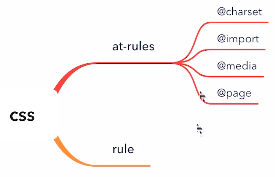
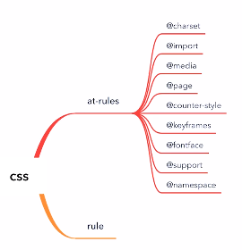

# CSS总论

## CSS语法的研究

### CSS总体结构

* @charset
* @import
* rules
    * @media
    * @page
    * rule



## CSS @规则的研究

### At-rules

* @charset：https://www.w3.org/TR/css-syntax-3/
* @import：https://www.w3.org/TR/css-cascade-4/
* @media：https://www.w3.org/TR/css3-conditional/
* @page：https://www.w3.org/TR/css-page-3/
* @counter-style：https://www.w3.org/TR/css-counter-styles-3
* @keyframes：https://www.w3.org/TR/css-animations-1/
* @fontface：https://www.w3.org/TR/css-fonts-3/
* @supports：https://www.w3.org/TR/css3-conditional/
* @namespace：https://www.w3.org/TR/css-namespaces-3/



## CSS规则的结构

* Selector
    * https://www.w3.org/TR/selectors-3/
    * https://www.w3.org/TR/selectors-4/
* Declaration
    * Key
        * Properties
        * Variables: https://www.w3.org/TR/css-variables/
    * Value
        * https://www.w3.org/TR/css-values-4/

## 收集标准

https://www.w3.org/TR/

```js
Array.prototype.slice.call(document.querySelector("#container").children).filter(e => e.getAttribute("data-tag").match(/css/)).map(e => ({name: e.children[1].innerText, url: e.children[1].children[0].href}))
```
## 总结

* CSS语法
* at-rule
* selector
* variables
* value
* 实验

# CSS选择器

## 选择器语法

* 简单选择器
    * *
    * div svg|a
    * .cls
    * #id
    * [attr=value]
    * :hover
    * :;before
* 复合选择器
    * <简单选择器> <简单选择器> <简单选择器>
    * * 或者div必须写在最前面
* 复杂选择器
    * <复合选择器> <sp> <复合选择器>
    * <复合选择器> ">" <复合选择器>
    * <复合选择器> "~" <复合选择器>
    * <复合选择器> "+" <复合选择器>
    * <复合选择器> "||" <复合选择器>

## 选择器的优先级

#id div.a#id {
    //....
}

[0,2,1,1]

S = 0 *N^3 + 2 * N^2 +1 * N^1 +1
取N = 10^6
S = 2000001000001