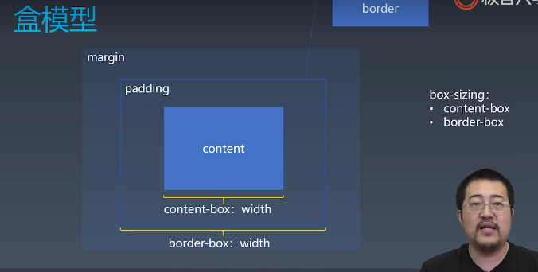
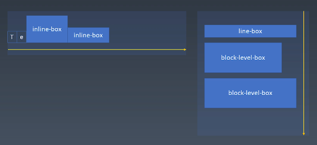

# 学习笔记

## CSS排版

### 盒

HTML代码中可以书写开始标签，结束标签，和自封闭标签。

一对起止标签，表示一个元素。

DOM树中存储的是元素和其它类型的节点（Node）。

CSS选择器选中的是元素（或伪元素）。

CSS选择器选中的元素，在排版时可能产生多个**盒**。

排版和渲染的基本单位是**盒**。

### 正常流

排版（layout）三代技术：

1. 第一代，正常流
2. 基于flex的排版（目前主流）
3. 基于grid的排版
4. 3.5代，CSS Houdini带来的完全自由的、可以拿js来干预的排版，可能是一个更后面，但是现在这个还不太明显

flex最简单最容易理解，正常流能力最差但是最复杂

正常流排版：

* 收集**盒**进行
* 计算盒在行中的派布
* 计算行的排布

