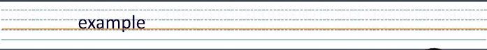
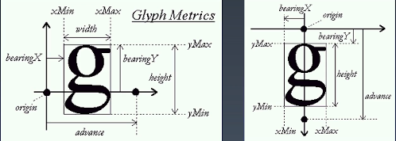
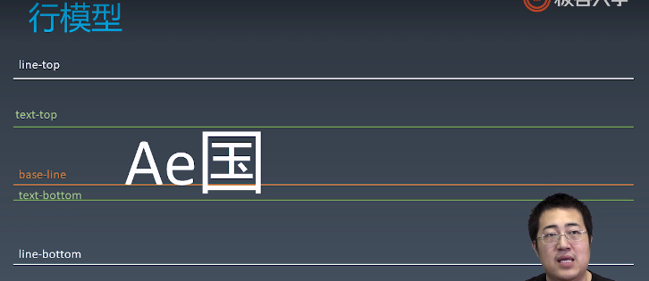
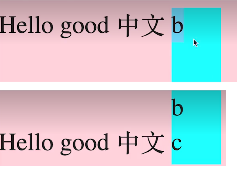
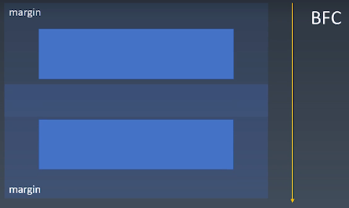
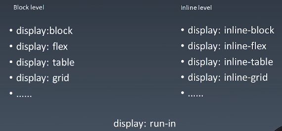

# 学习笔记

## CSS排版

### 盒

HTML代码中可以书写开始标签，结束标签，和自封闭标签。

一对起止标签，表示一个元素。

DOM树中存储的是元素和其它类型的节点（Node）。

CSS选择器选中的是元素（或伪元素）。

CSS选择器选中的元素，在排版时可能产生多个**盒**。

排版和渲染的基本单位是**盒**。

### 正常流

排版（layout）三代技术：

1. 第一代，正常流
2. 基于flex的排版（目前主流）
3. 基于grid的排版
4. 3.5代，CSS Houdini带来的完全自由的、可以拿js来干预的排版，可能是一个更后面，但是现在这个还不太明显

flex最简单最容易理解，正常流能力最差但是最复杂

正常流排版：

* 收集**盒**进行
* 计算盒在行中的派布
* 计算行的排布

### 正常流的行级排布

Baseline

Text

行内盒基线对齐会随着里面的文字变化，用vertical-align设置对应值调整top、middle、bottom、text-bottom、text-top

### 正常流的块级排布

正常流两个复杂的机制：float与clear……

margin堆叠，margin collapse，堆叠高度与最高margin相等，只会发生在BFC里，不会发生在IFC或是flex中

### BFC合并

BFC（Block Formatting Context），块级格式化上下文

* block box && overflow: visible
    * BFC合并与float
    * BFC合并与边距折叠

#### Block

* BLock Container：里面有BFC的
    * 能容纳正常流的盒，里面就有BFC，想想有哪些？
* Block-level Box：外面有BFC的
* Block Box = BLock Container + Block-level Box：里外都有BFC的

### Block Container

* block
* inline-block
* table-cell
* flex item
* grid cell
* table-caption

#### Block-level Box

`display: run-in`跟着自己上一个元素来

#### 设立BFC

* floats
* absolutely positioned elements
* block containers (such as inline-blocks, table-cells, and table-captions) that are not block boxes,
    * flex items
    * grid cell
    * ......
* and block boxes with `overflow` other than `visible`

换种方式更好记，能容纳正常流的盒，我们都认为它会创建BFC，但是只有一种情况例外（block box && overflow: visible）