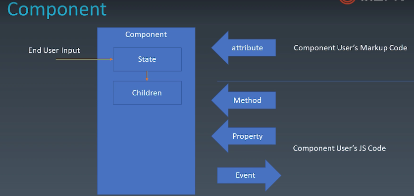
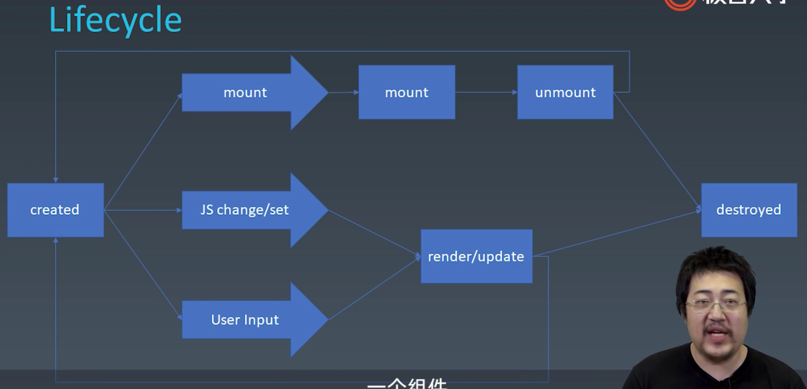

# 组件化

## 组件的基本知识

### 组件的基本概念和基本组成部分

我们怎么样去扩展HTML标签，从这个开始引申出来的前端的架构体系，主要目标就是复用。
架构模式就是大家特别熟悉的MVC啊MVVM它主要的关心就是前端和数据逻辑层之间，它是如何去交互的，所以说前端架构里面组件化的这个部分，可以说是重中之重，同时在我的实际的工程的实际操作里面，我认为组件化的重要性其实是比MVC这样的架构模式要更重要一些。因为组件化直接决定了你一个前端团队它的复用率。好的组件化体系能够帮助一个前端团队提升它的复用率，并且写代码的时候可以少很多的心智负担。

首先我们先了解一下组件的一些基本的概念和一个组件的基本的组成部分

#### 对象与组件

##### 对象

* Properties
* Methods
* Inherit

##### 组件

和UI强相关，某种意义上可以认为它是一种特殊的模块或者是特殊的对象
注意它即是对象又是模块
它可以以树形结构来进行组合，并且它有一定程度的这种模板化的配置的能力啊，这个就是我们组件的一个基本概念

* Properties
* Methods
* Inherit
* Attribute
* Config & State
* Event
* LifeCycle
* Children



JSX也可以理解为是一种嵌入在编程语言里面的XML的结构
然后Component User，就是这个使用组件的程序员，他除了通过Markup去影响组件，还可以通过Property去影响组件
attribute和Property是不是一回事完全取决于组件体系的设计者（有激进的方案把state config attribute property四者完全统一）
Method和Property其实差不多，只不过Method它可能用于描述一个复杂一点的过程，但javascript里的Property是允许有get和set的，所以两者最终是差不多的
如果说Method和Property是使用组件的程序员向开发组件的程序员传递信息，那么事件非常简单，它的方向反过来了，它是由开发组件的程序员向使用组件的程序员去传递信息，所以这一章图基本说明了组件的各个要素都是干嘛用的，以及他们的信息的流转的方向，到这里我们已经对组件有了一个初步的描述。接下来理清一些概念——

* Attribute vs Property

Attribute强调描述性，Property强调从属关系

Attribute:

```jsx
<my-component attribute="v" />
myComponent.getAttribute("a")
myComponent.setAttribute("a", "value")
```

Property:

```jsx
myCompnoent.a = "value"
```

class:

```html
<div class="cls1 cls2"></div>
<script>
    var div = document.getElementByTagName("div")
    div.className // cls1 cls2
</script>
```

style:

```html
<div class="cls1 cls2" style="color:blue"></div>
<script>
    var div = document.getElementByTagName("div")
    div.style // 对象
</script>
```

href:

```html
<a href="//m.taobao.com">aaa</a>
<script>
    var a = document.getElementByTagName("a")
    a.href // "http://m.taobao.com"，这个是resolve过的结果
    a.getAttribute("href") // "//m.taobao.com"，跟html代码中的完全一致
</script>
```

value:

```html
<input value="cute"/>
<script>
    var input = document.getElementByTagName("input") // 若property没有设置，则结果是attribute
    input.value // cute
    input.getAttribute("value") // cute
    input.value = "hello" // 若value属性已经设置，则attribute不变，property变化，元素上实际的效果是property优先
    input.value // hello
    input.getAttribute("value") // cute
</script>
```

attribute实际上相当于默认值的东西，以前jquery的时候经常有开发者会踩prop和attribute的坑，索性他后面出了val

###### 如何设置组件状态

| Markup Set | JS Set | JS Change | User Input Change |           |
|------------|--------|-----------|-------------------|-----------|
| N          | Y      | Y         | ?                 | property  |
| Y          | Y      | Y         | ?                 | attribute |
| N          | N      | N         | Y                 | state     |
| N          | Y      | N         | N                 | config    |

大多数情况下，prop是不允许用户输入去改变的，少数情况下，可能你的业务逻辑是允许的
attribute是Markup、js去设置，js也可以改变。用户的输入不一定会改变它，跟prop类似，大多数情况下，用户输入也是不会去改变attribute
state很大的特点就是，只能从组件的内部去改变，不会从组件的外部去改变，如果你想要设计一个东西是从组件外部去改变组件，一般来说是不会提供给你从外部改变state的能力，但是要保证用户输入能改变state
config只有在我组件构造的时候触发。因为不可更改性，通常会把它留给全局

###### LifeCycle

最容易想到两个：created、destroyed
世间一切一定有这两个生命周期



###### Children

* Content型Children与Template型Children

```jsx
// Content型
<my-button>{{title}}</my-button>

// Template型
<my-list>
    <li>{{title}}</li>
</my-list>
```

### 为组件添加JSX语法

关于一个组件系统，我们前面已经讲了，首先是一个由Markup和Javascript代码两者都可以访问的这样的一个环境，所以说第一步我们就需要去建立一个能够去使用Markup的环境，这里我们会给大家展示两种Markup建立的风格，第一种就是基于我们跟React一样的JSX去建立我们的组件的风格，第二种则是我们去基于类似Vue的这种标记语言的parser去建立组件的这样的一个风格。

我们这节课就先给大家讲一讲这个JSX，JSX其实大家一般的认知里面，它是属于React的一个部分，但是其实React在早期，尤其是Facebook在早期会把JSX定义成一种纯粹的语言扩展，它也是可以被其他的组件体系去使用的，甚至我们可以把它单纯作为一种创建HTML的标签的快捷方式去使用。

我们现在就来演示如何搭建起来一个简单的JSX的环境

```bash
mkdir jsx
cd jsx

# Create a node package
# with npm: npm init
yarn init

# Intsall webpack globally, npm might need root access since it will try executing this:
# $ mkdir '/usr/local/lib/node_modules/webpack' 
# with npm: npm install -g webpack webpack-cli
yarn global add webpack webpack-cli
# ...
# success Installed "webpack@5.34.0" with binaries:
#       - webpack
# success Installed "webpack-cli@4.6.0" with binaries:
#       - webpack-cli

# Check webpack version
webpack --version
# webpack 5.34.0
# webpack-cli 4.6.0

# JSX is a plugin of babel, so we need to install babel too
# with npm: npm install --save-dev webpack babel-loader
yarn add webpack babel-loader --dev
# yarn add v1.22.10
# info No lockfile found.
# [1/4] Resolving packages...
# [2/4] Fetching packages...
# [3/4] Linking dependencies...
# warning " > babel-loader@8.2.2" has unmet peer dependency "@babel/core@^7.0.0".
# [4/4] Building fresh packages...
# success Saved lockfile.
# success Saved 73 new dependencies.
# info Direct dependencies
# ├─ babel-loader@8.2.2
# └─ webpack@5.34.0
# info All dependencies
# ├─ @types/eslint-scope@3.7.0
# ├─ @types/eslint@7.2.10
# ├─ @types/json-schema@7.0.7
# ├─ @types/node@14.14.41
# ├─ @webassemblyjs/floating-point-hex-parser@1.11.0
# ├─ @webassemblyjs/helper-numbers@1.11.0
# ├─ @webassemblyjs/helper-wasm-section@1.11.0
# ├─ @webassemblyjs/wasm-edit@1.11.0
# ├─ @webassemblyjs/wasm-opt@1.11.0
# ├─ @webassemblyjs/wast-printer@1.11.0
# ├─ @xtuc/ieee754@1.2.0
# ├─ acorn@8.1.1
# ├─ ajv@6.12.6
# ├─ babel-loader@8.2.2
# ├─ big.js@5.2.2
# ├─ browserslist@4.16.4
# ├─ buffer-from@1.1.1
# ├─ caniuse-lite@1.0.30001211
# ├─ chrome-trace-event@1.0.3
# ├─ colorette@1.2.2
# ├─ commander@2.20.3
# ├─ commondir@1.0.1
# ├─ electron-to-chromium@1.3.717
# ├─ emojis-list@3.0.0
# ├─ enhanced-resolve@5.8.0
# ├─ es-module-lexer@0.4.1
# ├─ escalade@3.1.1
# ├─ eslint-scope@5.1.1
# ├─ esrecurse@4.3.0
# ├─ estraverse@4.3.0
# ├─ events@3.3.0
# ├─ fast-deep-equal@3.1.3
# ├─ fast-json-stable-stringify@2.1.0
# ├─ find-cache-dir@3.3.1
# ├─ find-up@4.1.0
# ├─ graceful-fs@4.2.6
# ├─ has-flag@4.0.0
# ├─ jest-worker@26.6.2
# ├─ json-parse-better-errors@1.0.2
# ├─ json-schema-traverse@0.4.1
# ├─ json5@1.0.1
# ├─ loader-runner@4.2.0
# ├─ loader-utils@1.4.0
# ├─ locate-path@5.0.0
# ├─ make-dir@3.1.0
# ├─ merge-stream@2.0.0
# ├─ mime-db@1.47.0
# ├─ mime-types@2.1.30
# ├─ minimist@1.2.5
# ├─ neo-async@2.6.2
# ├─ node-releases@1.1.71
# ├─ p-limit@3.1.0
# ├─ p-locate@4.1.0
# ├─ p-try@2.2.0
# ├─ path-exists@4.0.0
# ├─ pkg-dir@4.2.0
# ├─ punycode@2.1.1
# ├─ randombytes@2.1.0
# ├─ safe-buffer@5.2.1
# ├─ semver@6.3.0
# ├─ serialize-javascript@5.0.1
# ├─ source-list-map@2.0.1
# ├─ source-map-support@0.5.19
# ├─ source-map@0.6.1
# ├─ supports-color@7.2.0
# ├─ tapable@2.2.0
# ├─ terser-webpack-plugin@5.1.1
# ├─ terser@5.6.1
# ├─ uri-js@4.4.1
# ├─ watchpack@2.1.1
# ├─ webpack-sources@2.2.0
# ├─ webpack@5.34.0
# └─ yocto-queue@0.1.0
# Done in 27.25s.
```

接下来创建webpack.config.js
```
module.exports = {
    entry: "./main.js"
}
```

main.js
```
for(let i of [1,2,3]) {
    console.log(i)
}
```

```
[sim@simputer jsx]$ webpack
asset main.js 45 bytes [emitted] [minimized] (name: main)
./main.js 44 bytes [built] [code generated]

WARNING in configuration
The 'mode' option has not been set, webpack will fallback to 'production' for this value.
Set 'mode' option to 'development' or 'production' to enable defaults for each environment.
You can also set it to 'none' to disable any default behavior. Learn more: https://webpack.js.org/configuration/mode/

webpack 5.34.0 compiled with 1 warning in 236 ms
```

安装babel
```
[sim@simputer jsx]$ yarn add @babel/core @babel/preset-env --dev
yarn add v1.22.10
[1/4] Resolving packages...
[2/4] Fetching packages...
[3/4] Linking dependencies...
[4/4] Building fresh packages...
success Saved lockfile.
success Saved 100 new dependencies.
info Direct dependencies
├─ @babel/core@7.13.15
└─ @babel/preset-env@7.13.15
info All dependencies
├─ @babel/compat-data@7.13.15
├─ @babel/core@7.13.15
├─ @babel/helper-builder-binary-assignment-operator-visitor@7.12.13
├─ @babel/helper-compilation-targets@7.13.13
├─ @babel/helper-explode-assignable-expression@7.13.0
├─ @babel/helper-get-function-arity@7.12.13
├─ @babel/helper-hoist-variables@7.13.0
├─ @babel/helper-member-expression-to-functions@7.13.12
├─ @babel/helper-simple-access@7.13.12
├─ @babel/helper-wrap-function@7.13.0
├─ @babel/helpers@7.13.10
├─ @babel/highlight@7.13.10
├─ @babel/plugin-bugfix-v8-spread-parameters-in-optional-chaining@7.13.12
├─ @babel/plugin-proposal-async-generator-functions@7.13.15
├─ @babel/plugin-proposal-class-properties@7.13.0
├─ @babel/plugin-proposal-dynamic-import@7.13.8
├─ @babel/plugin-proposal-export-namespace-from@7.12.13
├─ @babel/plugin-proposal-json-strings@7.13.8
├─ @babel/plugin-proposal-logical-assignment-operators@7.13.8
├─ @babel/plugin-proposal-nullish-coalescing-operator@7.13.8
├─ @babel/plugin-proposal-numeric-separator@7.12.13
├─ @babel/plugin-proposal-object-rest-spread@7.13.8
├─ @babel/plugin-proposal-optional-catch-binding@7.13.8
├─ @babel/plugin-proposal-private-methods@7.13.0
├─ @babel/plugin-proposal-unicode-property-regex@7.12.13
├─ @babel/plugin-syntax-class-properties@7.12.13
├─ @babel/plugin-syntax-top-level-await@7.12.13
├─ @babel/plugin-transform-arrow-functions@7.13.0
├─ @babel/plugin-transform-async-to-generator@7.13.0
├─ @babel/plugin-transform-block-scoped-functions@7.12.13
├─ @babel/plugin-transform-block-scoping@7.12.13
├─ @babel/plugin-transform-classes@7.13.0
├─ @babel/plugin-transform-computed-properties@7.13.0
├─ @babel/plugin-transform-destructuring@7.13.0
├─ @babel/plugin-transform-dotall-regex@7.12.13
├─ @babel/plugin-transform-duplicate-keys@7.12.13
├─ @babel/plugin-transform-exponentiation-operator@7.12.13
├─ @babel/plugin-transform-for-of@7.13.0
├─ @babel/plugin-transform-function-name@7.12.13
├─ @babel/plugin-transform-literals@7.12.13
├─ @babel/plugin-transform-member-expression-literals@7.12.13
├─ @babel/plugin-transform-modules-amd@7.13.0
├─ @babel/plugin-transform-modules-commonjs@7.13.8
├─ @babel/plugin-transform-modules-systemjs@7.13.8
├─ @babel/plugin-transform-modules-umd@7.13.0
├─ @babel/plugin-transform-named-capturing-groups-regex@7.12.13
├─ @babel/plugin-transform-new-target@7.12.13
├─ @babel/plugin-transform-object-super@7.12.13
├─ @babel/plugin-transform-property-literals@7.12.13
├─ @babel/plugin-transform-regenerator@7.13.15
├─ @babel/plugin-transform-reserved-words@7.12.13
├─ @babel/plugin-transform-shorthand-properties@7.12.13
├─ @babel/plugin-transform-spread@7.13.0
├─ @babel/plugin-transform-sticky-regex@7.12.13
├─ @babel/plugin-transform-template-literals@7.13.0
├─ @babel/plugin-transform-typeof-symbol@7.12.13
├─ @babel/plugin-transform-unicode-escapes@7.12.13
├─ @babel/plugin-transform-unicode-regex@7.12.13
├─ @babel/preset-env@7.13.15
├─ @babel/preset-modules@0.1.4
├─ @babel/runtime@7.13.10
├─ ansi-styles@3.2.1
├─ babel-plugin-polyfill-corejs2@0.2.0
├─ babel-plugin-polyfill-corejs3@0.2.0
├─ babel-plugin-polyfill-regenerator@0.2.0
├─ call-bind@1.0.2
├─ chalk@2.4.2
├─ color-convert@1.9.3
├─ color-name@1.1.3
├─ convert-source-map@1.7.0
├─ core-js-compat@3.10.2
├─ debug@4.3.1
├─ define-properties@1.1.3
├─ escape-string-regexp@1.0.5
├─ esutils@2.0.3
├─ gensync@1.0.0-beta.2
├─ get-intrinsic@1.1.1
├─ is-core-module@2.2.0
├─ js-tokens@4.0.0
├─ jsesc@2.5.2
├─ json5@2.2.0
├─ lodash.debounce@4.0.8
├─ lodash@4.17.21
├─ ms@2.1.2
├─ object-keys@1.1.1
├─ object.assign@4.1.2
├─ path-parse@1.0.6
├─ regenerate-unicode-properties@8.2.0
├─ regenerator-runtime@0.13.7
├─ regenerator-transform@0.14.5
├─ regexpu-core@4.7.1
├─ regjsgen@0.5.2
├─ regjsparser@0.6.9
├─ resolve@1.20.0
├─ safe-buffer@5.1.2
├─ to-fast-properties@2.0.0
├─ unicode-canonical-property-names-ecmascript@1.0.4
├─ unicode-match-property-ecmascript@1.0.4
├─ unicode-match-property-value-ecmascript@1.2.0
└─ unicode-property-aliases-ecmascript@1.1.0
Done in 41.29s.
```

jsx支持——
```
[sim@simputer jsx]$ yarn add @babel/plugin-transform-react-jsx --dev
yarn add v1.22.10
[1/4] Resolving packages...
[2/4] Fetching packages...
[3/4] Linking dependencies...
[4/4] Building fresh packages...
success Saved lockfile.
success Saved 2 new dependencies.
info Direct dependencies
└─ @babel/plugin-transform-react-jsx@7.13.12
info All dependencies
├─ @babel/plugin-syntax-jsx@7.12.13
└─ @babel/plugin-transform-react-jsx@7.13.12
Done in 7.59s.
```

webpack.config.js
```
module.exports = {
    entry: "./main.js",
    module: {
        rules: [{
            test: /\.js$/, 
            use: {
                loader: "babel-loader",
                options: {
                    presets: ["@babel/preset-env"],
                    plugins: ["@babel/plugin-transform-react-jsx"]
                }
            }
        }]
    },
    "mode": "development"
}
```

### JSX的基本使用方法

JSX其实相当于一个代码，纯粹在语法上的一种快捷方式，我们已经看到他build出来呢JSX会被转换成一个React.createElement这样的一个调用
首先JSX的插件是允许我们在里面给它加上一个配置(在webpack.config.js里)

```
module.exports = {
    entry: "./main.js",
    module: {
        rules: [{
            test: /\.js$/, 
            use: {
                loader: "babel-loader",
                options: {
                    presets: ["@babel/preset-env"],
                    plugins: [["@babel/plugin-transform-react-jsx", {pragma: "createElement"}]]
                }
            }
        }]
    },
    mode: "development"
}
```

重新webpack，直接变成了createElement，就和React框架没有任何联系了
传参，第一个标签名称，第二个attribute的object，第三个及之后的都是内部的内容
这么一看JSX其实不神秘，只是把我们平时写的函数调用用了一个看起来比较像HTML的形式，给它改写了一下，我们可以认为这属于一种语法糖。但因为影响了代码结构，我们也不会认为它是一种语法糖


## 轮播组件

```
yarn add webpack-dev-server webpack-cli --dev
```

Boot
```
yarn run webpack-dev-server
```

encountered with the following problem:
```
Error: Cannot find module 'webpack-cli/bin/config-yargs'
```

How I solved it ([Link](https://stackoverflow.com/a/64304022)):
```
yarn run webpack serve
```

In dev mode, generated js won't be written to disk, to use them in browser, we need to do so by configuring webpack(https://github.com/webpack/webpack-dev-server/issues/1141#issuecomment-443468587, https://webpack.js.org/configuration/dev-server/#devserverwritetodisk-):  
```
devServer: {
  writeToDisk: true
}
```

* `img` is draggable thus not recommended for this component
